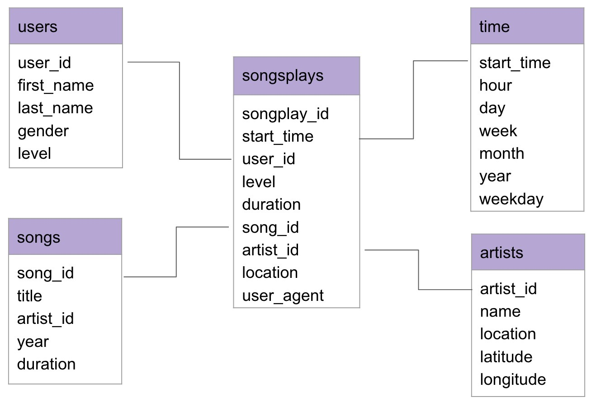

# Data Modeling with Postgres & ETL Pipeline for Sparkify

## ***Introduction***
---

The purpose of this project is to build a PostgreSQL database utilizing the data on users activity and songs metadata to helps us do complex analytics regarding users activity as well as song play analysis.

## ***Getting started***
---
#### There are Two types of files
* **Source code files** : Available in three separate Python scripts.
   1. `sql_queries.py` : Has all the queries needed to both create/drop tables for the database as well as a SQL query to get song_id and artist_id from other tables since they are not provided in logs dataset.

   2. `create_tables.py` : Creates the database, establish the connection and creates/drops all the tables required using sql_queries module.

   3. `etl.py` : Build the pipeline that extracts the data from JSON files, does some transformation (such as adding different time attributes from timestamp) and then insert all the data into the corresponding tables.


* **Notebooks** : Two notebooks
   1. `etl.ipynb` : Reads and processes a single file from `song_data` and `log_data` and loads the data into tables.

   2. `test.ipynb` : Displays the first few rows of each table to check the database.

Therefore, **in all time** we first need to run `create_tables.py` to create the database, create tables, then run `etl.py` to insert the data using the ETL pipeline,and finally use `test.ipynb` to check the database.

## ***Data***
---
The data resides in two main directories:
 * `Song Dataset` :a subset of real data from the [Million Song Dataset](http://millionsongdataset.com/). Each file is in JSON format and contains metadata about a song and the artist of that song. 
 
 
 * `Log Dataset` : consists of log files in JSON format generated by [Eventsim](https://github.com/Interana/eventsim) based on the songs in the dataset above. These simulate activity logs from a music streaming app based on specified configurations.

## ***Data Schema***
---
For queries on song play analysis, **Star schema** will be used utilizing dimensional modeling as follows:
1. #### **Fact Table** :     
    * `songplays` - records in log data associated with song plays i.e. records with page ***NextSong*** 
2. #### **Dimension Tables** :
    * `users` - Users in the app
    * `songs` - Songs in music database
    * `artists` - Artists in music database
    * `time` - Timestamps of records in ***songplays*** broken down into specific units



## ***ETL Pipeline Processes***
---

1. #### Songs metadata

    an example of what a single song json file looks like
    ```
    {
        num_songs:1
        artist_id:"AR0IAWL1187B9A96D0"
        artist_latitude:8.4177
        artist_longitude:-80.11278
        artist_location:"Panama"
        artist_name:"Danilo Perez"
        song_id:"SONSKXP12A8C13A2C9"
        title:"Native Soul"
        duration:197.19791
        year:2003
    }
    ```

    1. **songs table**
        * Parse and read a song JSON file by using pandas.read_json function.

        * Select columns for song_id, title, artist_id, year, and duration from dataframe.

        * Execute an insert query to songs table in PostgreSQL.

        * Repeat the process iterably for all songs data. 


        |song_id            |title          |artist_id          |year |duration  |
        |:-                 |:-             |:-                 |:-   |:-        |
        |SONSKXP12A8C13A2C9 |Native Soul    |AR0IAWL1187B9A96D0 |2003 |197.19791 |
        |SOFFKZS12AB017F194 |A Higher Place |ARBEBBY1187B9B43DB |1994 |236.17261 |

    2. **artists table**
        * Parse and read a song JSON file by using pandas.read_json function.

        * Select columns for artist ID, name, location, latitude, and longitude from dataframe.

        * Execute an insert query to artists table in PostgreSQL.

        * Repeat the process iterably for all songs data.


        |artist_id          |name              |location          |latitude           | longitude |
        |:-                 |:-                |:-                |:-                 | :-        |
        |AR0IAWL1187B9A96D0 |Danilo Perez      |Panama            |8.4177             |-80.11278  |
        |SOFFKZS12AB017F194 |Jinx              |Zagreb Croatia    |45.80726           | 15.9676   |


2. #### log_data metadata

    an example of what a single log json file looks like
    ```
    {
        "artist": "Pavement",
        "auth": "Logged In",
        "firstName": "Sylvie",
        "gender": "F",
        "itemInSession": 0,
        "lastName": "Cruz",
        "length": 99.16036,
        "level": "free",
        "location": "Washington-Arlington-Alexandria, DC-VA-MD-WV",
        "method": "PUT",
        "page": "NextSong",
        "registration": 1540266185796.0,
        "sessionId": 345,
        "song": "Mercy:The Laundromat",
        "status": 200,
        "ts": 1541990258796,
        "userAgent": "\"Mozilla/5.0 (Macintosh; Intel Mac OS X 10_9_4) AppleWebKit/537.77.4 (KHTML, like Gecko) Version/7.0.5 Safari/537.77.4\"",
        "userId": "10"
    }
    ```
    1. **time  table**
        * Parse and read a JSON file of user activity log by using pandas.read_json function.

        * Filter records by NextSong action.

        * Convert the ts timestamp column to datetime.

        * Extract the timestamp, hour, day, week of year, month, year, and weekday from dataframe.
        
        * Execute an insert query to time table in PostgreSQL.
        
        * Repeat the process iterably for all log files.


        |start_time                 |hour |day |week |month  |year |weekday    |
        |:-                         |:-   |:-  |:-   |:-     |:-   |:-         |
        |2018-11-29 00:00:57.796000 |0    |29  |48   |11     |2018 |Thursday   |
        |2018-11-29 00:15:41.796000 |0    |29  |48   |11     |2018 |Thursday   |
       
    2. **users table**
        * Parse and read a JSON file of user activity log by using pandas.read_json function.

        * Filter records by NextSong action.

        * Select columns for userId, firstName, lastName, gender and level from dataframe.

        * Execute an insert query to songs table in PostgreSQL.

        * Repeat the process iterably for all log files.


        |user_id |first_name |last_name |gender |level |
        |:-      |:-         |:-        |:-     |:-    |
        |26      |Ryan       |Smith     |M      |free  |
        |15      |Lily       |Koch      |F      |paid  |

    3. **songsplays table**
        * Parse and read a JSON file of user activity log by using pandas.read_json function.

        * Filter records by NextSong action.

        * Select the timestamp, userId, level, sessionId, location, and userAgent from dataframe

        * Log files don't include song_id and artist_id, so get these ID by executing select query to songs and artists tables.

        * Execute an insert query to songs table in PostgreSQL.

        * Repeat the process iterably for all log files.
      
        |songplay_id |start_time                 |user_id |level |song_id             |artist_id          |session_id |location                             |user_agent                                                                                                                                |
        | :-         | :-                        | :-     | :-   |:-                  | :-                | :-        | :-                                  | :-                                                                                                                                       |
        |483         |2018-11-21 21:56:47.796000 |15      |paid  |SOZCTXZ12AB0182364  |AR5KOSW1187FB35FF4 | 818       | Chicago-Naperville-Elgin, IL-IN-WI  |"Mozilla/5.0 (X11; Linux x86_64) AppleWebKit/537.36 (KHTML, like Gecko) Ubuntu Chromium/36.0.1985.125 Chrome/36.0.1985.125 Safari/537.36  | 
        |2           |2018-11-29 00:01:30.796000 |24      |paid  | -                  | -                 | 984       | Lake Havasu City-Kingman, AZ        |"Mozilla/5.0 (X11; Linux x86_64) AppleWebKit/537.36 (KHTML, like Gecko) Ubuntu Chromium/36.0.1985.125 Chrome/36.0.1985.125 Safari/537.36  |